# 🏫 School Attendance Management System

> A comprehensive, multi-tenant SaaS platform for managing student attendance using RFID technology, with real-time dashboards, SMS/WhatsApp notifications, and mobile apps for teachers and parents.

---

## 📋 Table of Contents

- [Overview](#-overview)
- [System Architecture](#-system-architecture)
- [Technology Stack](#-technology-stack)
- [System Components](#-system-components)
- [Data Flow Diagrams](#-data-flow-diagrams)
- [Database Schema](#-database-schema)
- [API Endpoints](#-api-endpoints)
- [User Roles & Access](#-user-roles--access)
- [Key Features](#-key-features)
- [Installation & Setup](#-installation--setup)
- [Project Structure](#-project-structure)
- [Workflow Guide](#-workflow-guide)

---

## 🎯 Overview

This School Attendance System is a complete solution for tracking student attendance in schools. It integrates with **ZKTeco RFID devices** to automatically record when students check in/out. The system provides:

- **Real-time attendance tracking** via RFID cards
- **Automatic SMS/WhatsApp notifications** to parents when students are absent or late
- **Web dashboards** for school administrators and super admins
- **Mobile app** for teachers and parents
- **Multi-tenant architecture** supporting multiple schools

---

## 🏗 System Architecture

```mermaid
graph TB
    subgraph "Hardware Layer"
        RFID[("🔷 ZKTeco K40 Pro<br/>RFID Devices")]
    end
    
    subgraph "Backend Layer"
        API[("🖥 Node.js/Express<br/>REST API Server")]
        DB[(🗄 PostgreSQL<br/>Database)]
        CRON[("⏰ Background Services<br/>Auto-Absence, Sync")]
    end
    
    subgraph "Notification Layer"
        SMS[("📱 Twilio SMS")]
        WA[("💬 WhatsApp API")]
    end
    
    subgraph "Frontend Layer"
        DASH[("📊 School Dashboard<br/>React.js")]
        SUPER[("👑 Super Admin Panel<br/>React.js")]
        APP[("📲 Mobile App<br/>Flutter")]
    end
    
    RFID -->|"iclock Protocol"| API
    API <--> DB
    API --> CRON
    CRON --> SMS
    CRON --> WA
    API --> DASH
    API --> SUPER
    API --> APP
```



---

## 🛠 Technology Stack

| Component | Technology | Version |
|-----------|------------|---------|
| **Backend API** | Node.js + Express | 4.18.x |
| **Database** | PostgreSQL | 14+ |
| **School Dashboard** | React.js | 18.x |
| **Super Admin Panel** | React.js | 18.x |
| **Mobile App** | Flutter/Dart | 3.x |
| **RFID Integration** | ZKTeco iclock Protocol | - |
| **SMS Service** | Twilio | 5.x |
| **Real-time** | Socket.IO | 4.x |
| **Authentication** | JWT | 9.x |

---

## 📦 System Components

### 1. Backend API (`/backend`)
The core REST API server handling all business logic.

| Directory | Purpose |
|-----------|---------|
| `src/controllers/` | 22 controllers handling requests |
| `src/models/` | 14 data models (User, Student, Attendance, etc.) |
| `src/routes/` | 15 route definitions |
| `src/services/` | 7 background services |
| `src/middleware/` | Authentication, validation, rate limiting |
| `migrations/` | 25 database migration files |

### 2. School Dashboard (`/school-dashboard`)
React-based web interface for school administrators.

| Page | Features |
|------|----------|
| Dashboard | Real-time stats, recent check-ins, attendance trends |
| Students | Manage students, assign RFID, bulk import |
| Teachers | Teacher management, class assignments |
| Classes | Class/section management |
| Attendance | Daily view, calendar view, reports |
| Devices | RFID device management and sync status |
| Reports | Generate attendance reports |
| Settings | School settings, timings, notifications |

### 3. Super Admin Panel (`/super-admin-panel`)
Multi-tenant management dashboard for platform administrators.

| Page | Features |
|------|----------|
| Dashboard | Platform-wide statistics |
| Schools | Manage registered schools |
| Devices | All devices across schools |
| Users | Admin user management |
| Audit Logs | System activity tracking |
| System Settings | Platform configuration |

### 4. Mobile App (`/School-attendance-app`)
Flutter-based mobile application for teachers and parents.

| Screen | Features |
|--------|----------|
| Teacher Dashboard | Class attendance, student list |
| Parent Dashboard | Child's attendance history |
| Attendance Calendar | Monthly attendance view |
| Leave Management | Apply/approve leaves |
| Reports | Attendance reports |

---

## 🔄 Data Flow Diagrams

### RFID Attendance Flow


### Auto-Absence Detection Flow


### User Authentication Flow


### Student Sync to Device Flow


---

## 🗄 Database Schema


### Key Tables

| Table | Purpose |
|-------|---------|
| `schools` | School registration and settings |
| `users` | Admin users and authentication |
| `students` | Student profiles with RFID |
| `teachers` | Teacher profiles |
| `classes` | Class definitions (Grade 1, 2, etc.) |
| `sections` | Class sections (A, B, C) |
| `attendance_logs` | Individual attendance records |
| `devices` | RFID device registry |
| `device_commands` | Pending commands for devices |
| `device_user_sync_status` | Track student sync to devices |
| `holidays` | School holidays |
| `leaves` | Student leave applications |
| `academic_years` | Academic year management |
| `audit_logs` | System activity logs |

---

## 🔌 API Endpoints

### Authentication
| Method | Endpoint | Description |
|--------|----------|-------------|
| POST | `/api/v1/auth/login` | User login |
| POST | `/api/v1/auth/refresh` | Refresh JWT token |
| POST | `/api/v1/auth/logout` | User logout |

### School Admin Routes
| Method | Endpoint | Description |
|--------|----------|-------------|
| GET | `/api/v1/school/dashboard` | Dashboard statistics |
| GET/POST | `/api/v1/school/students` | Manage students |
| GET/POST | `/api/v1/school/teachers` | Manage teachers |
| GET/POST | `/api/v1/school/classes` | Manage classes |
| GET | `/api/v1/school/attendance` | Get attendance logs |
| POST | `/api/v1/school/bulk-upload` | Bulk import students |

### Device Routes (iclock Protocol)
| Method | Endpoint | Description |
|--------|----------|-------------|
| GET | `/iclock/cdata` | Device initial handshake |
| POST | `/iclock/cdata` | Receive attendance logs |
| GET | `/iclock/getrequest` | Send commands to device |
| POST | `/iclock/devicecmd` | Receive command results |

### Super Admin Routes
| Method | Endpoint | Description |
|--------|----------|-------------|
| GET | `/api/v1/superadmin/schools` | List all schools |
| GET | `/api/v1/superadmin/devices` | List all devices |
| GET | `/api/v1/superadmin/audit-logs` | System audit logs |
| POST | `/api/v1/superadmin/settings` | Platform settings |

### Teacher Routes
| Method | Endpoint | Description |
|--------|----------|-------------|
| POST | `/api/v1/teacher/auth/login` | Teacher login |
| GET | `/api/v1/teacher/dashboard` | Teacher dashboard |
| GET | `/api/v1/teacher/attendance` | Class attendance |
| POST | `/api/v1/teacher/attendance/mark` | Manual attendance |

---

## 👤 User Roles & Access

```mermaid
graph LR
    subgraph "Access Levels"
        SA[("👑 Super Admin")]
        SC[("🏫 School Admin")]
        TC[("👨‍🏫 Teacher")]
        PR[("👨‍👩‍👧 Parent")]
    end
    
    SA --> |Full platform access| ALL[All Schools & Settings]
    SC --> |Single school| SCHOOL[Own School Data]
    TC --> |Assigned classes| CLASS[Class Students]
    PR --> |Own children| CHILD[Child Data Only]
```



| Role | Access Level | Capabilities |
|------|--------------|--------------|
| **Super Admin** | Platform | Manage all schools, devices, settings |
| **School Admin** | School | Manage students, teachers, attendance |
| **Teacher** | Class | View/mark class attendance, leaves |
| **Parent** | Child | View child attendance, apply leaves |

---

## ✨ Key Features

### 1. RFID Attendance Tracking
- Automatic check-in/out via RFID cards
- Support for ZKTeco K40 Pro devices
- Bi-directional sync (add/remove students)

### 2. Smart Notifications
- **SMS Alerts**: Late arrival, absence notification
- **WhatsApp Integration**: Rich message templates
- **Batch Processing**: Optimized for high volume

### 3. Auto-Absence Detection
- Scheduled job at 11:00 AM daily
- Marks absent students automatically
- Triggers SMS to parents

### 4. Academic Year Management
- Multiple academic years support
- Student promotion between years
- Historical attendance data

### 5. Comprehensive Reports
- Daily attendance summary
- Monthly attendance calendars
- Class-wise reports
- Export to PDF/Excel

### 6. Multi-Tenant Architecture
- Isolated data per school
- Customizable school settings
- Independent device management

---

## 🚀 Installation & Setup

### Prerequisites
- Node.js 16+
- PostgreSQL 14+
- Flutter 3.x (for mobile app)

### Backend Setup

```bash
# Navigate to backend
cd backend

# Install dependencies
npm install

# Configure environment
cp .env.example .env
# Edit .env with your database credentials

# Run migrations
npm run db:migrate

# Start server
npm run dev
```

### Environment Variables

```env
# Database
DB_HOST=localhost
DB_PORT=5432
DB_NAME=school_attendance
DB_USER=postgres
DB_PASSWORD=your_password

# JWT
JWT_SECRET=your_secure_secret_key

# Twilio (SMS)
TWILIO_ACCOUNT_SID=ACxxxxx
TWILIO_AUTH_TOKEN=xxxxx
TWILIO_PHONE_NUMBER=+1xxxxx

# Server
PORT=5000
NODE_ENV=development
```

### School Dashboard Setup

```bash
cd school-dashboard
npm install
npm start
# Opens at http://localhost:3000
```

### Super Admin Panel Setup

```bash
cd super-admin-panel
npm install
npm start
# Opens at http://localhost:3001
```

### Mobile App Setup

```bash
cd School-attendance-app
flutter pub get
flutter run
```

---

## 📁 Project Structure

```
school-attendance-system/
├── backend/                     # Node.js API Server
│   ├── src/
│   │   ├── config/             # Database & app config
│   │   ├── controllers/        # Request handlers (22 files)
│   │   ├── middleware/         # Auth, validation (8 files)
│   │   ├── models/             # Data models (14 files)
│   │   ├── routes/             # API routes (15 files)
│   │   ├── services/           # Background services (7 files)
│   │   ├── utils/              # Helper utilities
│   │   └── server.js           # Entry point
│   └── migrations/             # SQL migrations (25 files)
│
├── school-dashboard/           # React Dashboard
│   ├── src/
│   │   ├── components/         # Reusable components
│   │   ├── pages/              # Page components (20 files)
│   │   ├── contexts/           # React context
│   │   └── utils/              # Utility functions
│   └── public/
│
├── super-admin-panel/          # React Admin Panel
│   ├── src/
│   │   ├── components/         # Reusable components
│   │   ├── pages/              # Page components (9 files)
│   │   └── contexts/           # React context
│   └── public/
│
├── School-attendance-app/      # Flutter Mobile App
│   ├── lib/
│   │   ├── screens/            # UI screens (15 files)
│   │   ├── models/             # Data models
│   │   ├── providers/          # State management
│   │   └── services/           # API services
│   └── pubspec.yaml
│
└── docs/                       # Documentation files
```

---

## 📖 Workflow Guide

### Daily Operations


### Adding a New School

1. **Super Admin** creates school in Super Admin Panel
2. System generates unique school code
3. Creates school admin credentials
4. School admin logs in to School Dashboard
5. Configures school timings and settings
6. Adds classes and sections
7. Imports/adds students with RFID
8. Registers RFID devices
9. System syncs students to devices

### Registering RFID Devices

1. Connect ZKTeco device to network
2. Configure device server URL to backend
3. Device sends handshake to `/iclock/cdata`
4. Admin adds device in dashboard
5. Link device to school
6. System queues student sync commands
7. Device receives and adds users

### Generating Reports

1. Navigate to Reports page
2. Select date range
3. Choose filters (class, section)
4. View attendance statistics
5. Export as PDF or Excel

---

## 🔒 Security Features

- **JWT Authentication** with secure tokens
- **Rate Limiting** to prevent DOS attacks
- **Helmet.js** security headers
- **Multi-tenant isolation** - school data is segregated
- **Audit logs** for all critical operations
- **Password hashing** with bcrypt

---

## 📞 Support

For issues and questions, refer to the extensive documentation in the repository:

- `DEPLOYMENT_GUIDE.md` - Production deployment
- `ZKTECO_README.md` - Device integration
- `WHATSAPP_SETUP_GUIDE.md` - WhatsApp configuration
- `LOGIN_CREDENTIALS.md` - Default credentials

---

## 📄 License

MIT License - See LICENSE file for details.
